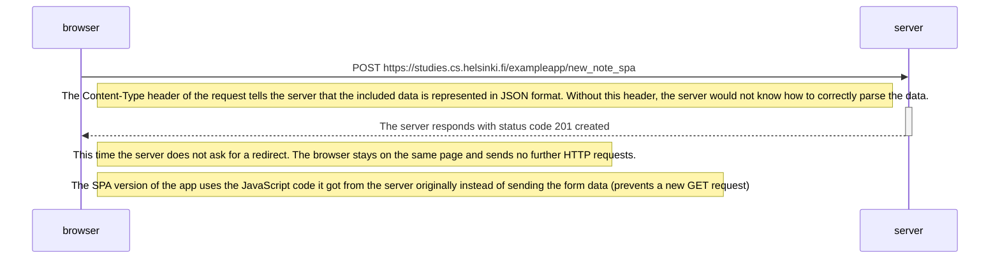

This diagram shows what happens where a user creates a new note using the single-page version of the app.
...

```mermaid
    sequenceDiagram
    participant browser
    participant server

    browser->>server: POST https://studies.cs.helsinki.fi/exampleapp/new_note_spa

    Note right of browser: The Content-Type header of the request tells the server that the included data is represented in JSON format. Without this header, the server would not know how to correctly parse the data.

    activate server
    server-->>browser: The server responds with status code 201 created
    deactivate server

    Note right of browser: This time the server does not ask for a redirect. The browser stays on the same page and sends no further HTTP requests.

    Note right of browser: The SPA version of the app uses the JavaScript code it got from the server originally instead of sending the form data (prevents a new GET request)

```
